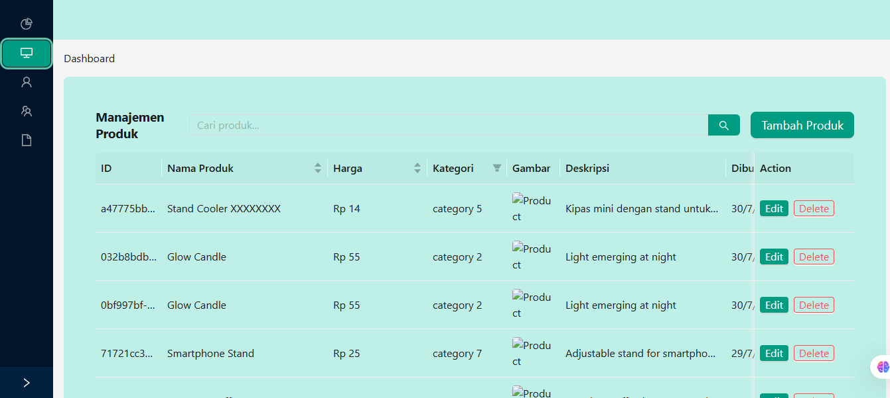

# SGT Dashboard Test



## Deskripsi
Sebuah aplikasi web dibangun dengan Next.js yang [jelaskan secara singkat tujuan/fitur utama aplikasi Anda].

## Teknologi yang Digunakan

### Bahasa Pemrograman & Framework


### Styling


### Lainnya


## Persyaratan Sistem

- Node.js v22.17.0
- npm v10.9.2
- npx v10.9.2
- Next.js v14.2.30
- ant-design/nextjs-registry v1.1.0
- types/node v20.19.9
- types/react-dom v18.3.7
- types/react v18.3.23
- axios v1.11.0
- dotenv v17.2.1
- eslint-config-next v14.2.30
- eslint v8.57.1
- next v14.2.30
- react-dom v18.3.1
- react v18.3.1
- typescript v5.8.3

## Instalasi

1. Clone repositori ini:
   ```bash
   git clone https://github.com/luthfibg/sgt-frontend.git
   ```

2. Masuk ke direktori projek
   ```
   cd sgt-frontend
   ```

3. Install dependencies
   ```
   npm install
   ```

4. Buat file `.env` berdasarkan `.env.example` dan variabel lingkungan yang diperlukan.

## Menjalankan projek

### Development mode
```
npm run dev
```
